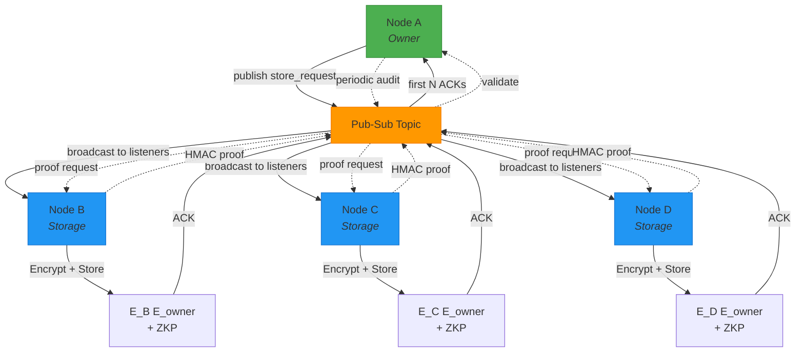

# Quloud

**Trustless Federated Storage — Autonomous NAS Nodes with Zero-Knowledge Access Control**

> *Decentralized redundancy without trust. Your data, your keys, no compromises.*

## Overview

Quloud is a single-node implementation for participating in a trustless federated storage network. Each installation runs independently on a NAS device, cooperating with other nodes to provide cross-node redundancy while maintaining complete encryption control.

The federation emerges from multiple autonomous nodes communicating - there is no central coordinator. Each node manages its own encryption keys, validates requests cryptographically, and operates without trusting other nodes in the network.

### Federation Principles

| Principle | Description |
|-----------|-------------|
| **Autonomy** | Every node runs independently; no coordinator or registry |
| **No Trust** | Nodes verify access cryptographically, not through identity or reputation |
| **Open Participation** | Anyone can run a node and join the network |
| **End-to-End Encryption** | Data is encrypted by the owner *before* distribution |

## Core Concepts

### Anonymous Message-Driven Storage

Quloud uses a **message-driven architecture** where nodes don't need to know about each other. Instead of selecting specific storage nodes, the owner publishes encrypted chunks to a topic and lets the network organically handle replication:

- **No peer discovery required** - nodes don't maintain peer lists
- **Anonymous replication** - owner doesn't choose who stores data
- **Quorum-based writes** - first N nodes to successfully store and ACK become replicas
- **Self-organizing** - storage emerges from cryptographic verification, not coordination

This transforms storage from a "relationship between known nodes" into a "cryptographic service" - you prove ownership to retrieve, not identity.

### Multi-Layer Encryption & Zero-Knowledge Proofs

When Node A stores data across the federation:

1. **Owner Encryption**: Node A encrypts the file with its **private key** → produces `E_owner(data)`
2. **ZKP Generation**: Node A generates a **zero-knowledge proof** (ZKP) proving ownership of the decryption key, without revealing it
3. **Publish to Topic**: Node A publishes `E_owner(data)` + ZKP to a storage request topic
4. **Quorum Response**: First N storage nodes to receive the message store the chunk and ACK
5. **Storage Node Wrapping**: Each storage node re-encrypts the chunk with its **own private key** → `E_storage(E_owner(data))`
6. **Metadata Storage**: The ZKP is stored as **encrypted metadata**, locked under the storage node's key

**Result**: Two layers of encryption. A compromised storage node cannot read the data *or* the ZKP. Even if the ZKP were leaked, the data remains encrypted under Node A's key. Owner receives list of nodes that ACKed for future auditing.

### Data Retrieval Flow

Owner publishes retrieval request to topic with chunk ID and ZKP. Any storage node holding that chunk verifies the ZKP and responds:

```
Node A (Owner)           Pub-Sub Topic              Storage Nodes (B, C, D)
     │                         │                            │
     ├─ publish ─────────────▶│                            │
     │  retrieve_request       │                            │
     │  (chunk_id, ZKP)        ├──────────────────────────▶│
     │                         │                            │
     │                         │         ◀─ verify ZKP ─────┤
     │                         │         decrypt metadata   │
     │                         │                            │
     │                         │◀─── E_owner(data) ─────────┤
     │◀─ first response ───────┤                            │
     │                         │                            │
     │ Decrypt with owner key  │                            │
     ▼                         ▼                            ▼
Original data recovered
```

- Storage nodes only respond if they have the chunk AND ZKP verifies
- Owner accepts first valid response (or waits for multiple for verification)
- Storage nodes **never see plaintext** and **don't need to trust owner**
- Anonymous retrieval - owner doesn't need to remember who stored it

### Owner-Initiated Auditing & Self-Healing

The owner controls when and how often to verify storage integrity:

1. **Audit Request**: Owner publishes proof-of-storage request with chunk ID and challenge seed
2. **Cryptographic Response**: Storage nodes respond with `HMAC(node_key, chunk_id + E_owner(data) + challenge_seed)`
3. **Validation**: Owner verifies responses - each node must prove it has the actual data
4. **Self-Healing**: If fewer than N valid responses received, owner triggers automatic re-replication

**Benefits:**
- **Owner sovereignty** - you decide audit frequency (hourly, weekly, never)
- **No false positives** - storage nodes don't broadcast unless asked
- **Replay protection** - fresh challenge seed prevents reuse of old proofs
- **Automatic recovery** - missing responses trigger replication to maintain quorum
- **Privacy preserved** - no periodic broadcasts revealing what each node stores

This creates self-healing storage where redundancy is actively maintained by the data owner.

### Secure Data Sharing

**Primary Method: Physical Key Exchange (Human-to-Human)**

- Node A shares its **decryption key** directly with Node C (e.g., USB drive, QR code, paper)
- Node C uses the key to decrypt data retrieved via the same ZKP-based protocol
- Storage nodes remain unaware of sharing—**privacy preserved**

This keeps trust **out of the network** and in the real-world relationship.

**Future: Link Relationships (Re-encryption Relay)**

- Node A creates a **shared key** `K_shared` for Node C
- Node A decrypts `E_owner(data)` locally, re-encrypts with `K_shared` → `E_shared(data)`
- Generates a **new ZKP** for `K_shared` and distributes to storage nodes
- Node C retrieves data using the new ZKP and `K_shared`

The trust relationship is **personal and internal**—only between Node A and Node C. The network remains trustless.

## Architecture

### High-Level Data Flow



### Node Responsibilities

Each node must implement:

| Function | Description |
|----------|-------------|
| `subscribe_to_topics()` | Listen to storage request and retrieval request topics |
| `accept_chunk()` | Receive and store encrypted chunks + ZKP metadata from topic |
| `ack_storage()` | Publish ACK to topic confirming successful storage |
| `respond_to_retrieval()` | Return data only if valid ZKP is presented in retrieval request |
| `respond_to_audit()` | Generate HMAC proof when owner publishes audit request |
| `encrypt_chunk()` | Apply local encryption layer to all stored data |
| `decrypt_chunk()` | Remove local encryption layer (for returning owned data) |
| `validate_zkp()` | Verify ZKP before storing or returning data |

### Message-Driven Protocol

All node communication happens through publish-subscribe topics:

**Storage Flow:**
1. Owner publishes `store_request` to topic
2. Storage nodes subscribe and race to store
3. First N nodes to successfully store publish `store_ack`
4. Owner collects ACKs and records replica locations

**Retrieval Flow:**
1. Owner publishes `retrieve_request` with chunk ID and ZKP
2. Any node holding the chunk validates ZKP and responds
3. Owner accepts first valid response

**Audit Flow:**
1. Owner publishes `proof_of_storage_request` with challenge seed
2. Storage nodes respond with HMAC proof
3. Owner validates and triggers re-replication if needed

This eliminates peer discovery, connection management, and coordination overhead.

### Protocol Boundary

The federation protocol defines **how nodes communicate**, not how they store data locally. Each node can:
- Use any storage backend (filesystem, database, object storage)
- Implement any chunking strategy
- Choose any indexing approach

As long as the node responds correctly to protocol requests, it's a valid federation participant.

### Security Model

| Threat | Mitigation |
|--------|------------|
| Compromised storage node | Data still encrypted with owner key |
| Leaked ZKP | Useless without owner key |
| Malicious retriever | ZKP prevents unauthorized access |
| Lost replica | Owner-initiated audits detect missing storage; automatic re-replication |
| Replay attack | Fresh challenge seed in each audit prevents proof reuse |
| Data corruption | HMAC proof includes actual data; corruption causes validation failure |
| Sybil attack | Future: proof-of-resource or reputation-based filtering |
| Key loss | No recovery by design; future: Shamir's Secret Sharing |

## Technology

- **Language**: Python 3.13+
- **Package Management**: uv
- **Architecture**: Hexagonal (ports & adapters)
- **Pub-Sub Infrastructure**: TBD (investigating options - see [RESEARCH.md](RESEARCH.md))
- **Cryptography**: TBD (investigating ZKP libraries - see [RESEARCH.md](RESEARCH.md))
- **Network**: TBD (protocol design in progress - see [RESEARCH.md](RESEARCH.md))

## Current Status

**Phase**: Core Implementation Complete

✅ Project structure initialized
✅ Core architecture defined (hexagonal/ports & adapters)
✅ Message-driven protocol design
✅ Owner-initiated auditing model
✅ Self-healing replication strategy
✅ Design conversations documented
✅ Pub-sub infrastructure (RabbitMQ via [synapse](https://github.com/IzzyFuller/synapse))
✅ Proof-of-storage with replay protection (SHA-256 challenge-response)
✅ Storage adapter (filesystem)
✅ Encryption service (PyNaCl SecretBox - XSalsa20 + Poly1305)
✅ Double-encryption: E_node(E_owner(data))
✅ 63 tests, 78% coverage
🔄 ZKP implementation (see [RESEARCH.md](RESEARCH.md))
⬜ CLI interface
⬜ Multi-node integration tests  

## Getting Started

**Prerequisites:**
- Python 3.13+
- uv package manager

**Installation:**
```bash
git clone https://github.com/IzzyFuller/Quloud.git
cd Quloud
uv sync
```

**Note**: Mermaid diagrams in this README render automatically on GitHub. For local rendering, install dev dependencies: `uv sync --extra dev`

## Design Documentation

Design conversations and architectural evolution:
- [initiating_conversation.md](initiating_conversation.md) - Initial design exploration with Duck.ai
- [confer_dot_io_review_of_project.md](confer_dot_io_review_of_project.md) - Extended architecture discussion and evolution to message-driven model
- [RESEARCH.md](RESEARCH.md) - Technical options for implementation (libraries, protocols, infrastructure)

## Contributing

This is an early-stage project. Design feedback and architectural discussion welcome.

## License

MIT License - see [LICENSE](LICENSE)

---

**Repository**: [IzzyFuller/Quloud](https://github.com/IzzyFuller/Quloud)
